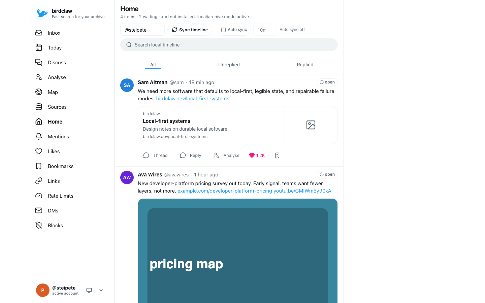

# birdclaw 🪶 — Your Twitter history, with a longer memory

[](https://github.com/steipete/birdclaw/actions/workflows/ci.yml)
[](https://www.npmjs.com/package/birdclaw)
[](https://nodejs.org/)
[](https://bun.sh/blog/bun-in-rust)
[](LICENSE)
[](https://github.com/steipete/homebrew-tap)
[](https://birdclaw.sh)

Birdclaw imports Twitter/X archives into local SQLite, adds explicit cached live reads, and exposes the result through a web app, CLI, and optional read-only MCP server. It is for people who want their own searchable history, DMs, saved posts, and follow graph without a cloud backend.



## Install

Homebrew is the shortest path on macOS and Linux:

```bash
brew install steipete/tap/birdclaw
```

The package is also published on npm:

```bash
npm install -g birdclaw
```

The npm and Homebrew installs retain the public Node.js `>=26.5.1 <27` contract. Source development uses one checksum-pinned Bun `1.4.0-canary.1` build and keeps Node as a tested compatibility lane. See the [installation guide](https://birdclaw.sh/install.html) for setup and the [Bun canary reference](https://birdclaw.sh/bun-canary.html) for exact checksums, constraints, and rollback boundaries.

## Quick start

Create a self-contained demo, search it locally, then open the web app:

```bash
birdclaw init --demo
birdclaw search tweets "local-first" --limit 3 --json
birdclaw serve
```

Open <http://localhost:3000>. The demo seeds sample tweets, DMs, profiles, and links without credentials or network requests.

## Use your archive

A Twitter/X archive establishes the account identity for a new real database and imports tweets, DMs, likes, bookmarks, profiles, media, and follow edges:

```bash
birdclaw import archive ~/Downloads/twitter-archive.zip --json
```

Imports are idempotent and merge destination-only rows by default. Selected re-imports and exact replacement are documented in [Archive import](https://birdclaw.sh/archive.html).

Birdclaw stores its database, configuration, and media under `~/.birdclaw`. Set `BIRDCLAW_HOME` to use another root.

## Add live data

Archive and local search work without an X login. Live sync delegates to [`xurl`](https://github.com/xdevplatform/xurl) or an existing private `bird` installation and only runs when requested:

```bash
birdclaw sync timeline --limit 100 --refresh --json
birdclaw sync bookmarks --mode auto --limit 100 --refresh --json
```

Import an archive before the first live sync on a new database. The [sign-in guide](https://birdclaw.sh/auth.html) explains xurl setup and transport selection; the [sync guide](https://birdclaw.sh/sync.html) covers caching, pagination, and rate limits.

## Work locally

SQLite is the canonical store. Archive imports and live transports converge on the same tables, and FTS5 powers local tweet and DM search.

| Surface | What it provides | Guide |
| --- | --- | --- |
| Web app | Home, mentions, saved posts, DMs, inbox, moderation, and network views | [Quickstart](https://birdclaw.sh/quickstart.html) |
| CLI | Search, sync, moderation, research, JSON output, and scheduled jobs | [CLI reference](https://birdclaw.sh/cli.html) |
| Backup | Deterministic JSONL shards that round-trip through Git | [Backup](https://birdclaw.sh/backup.html) |
| MCP | Read-only cached tweet search and thread tools behind a dedicated token | [MCP server](https://birdclaw.sh/mcp.html) |

Local reads do not trigger network traffic by default. The web server listens on loopback, live writes can be disabled with `BIRDCLAW_DISABLE_LIVE_WRITES=1`, and the MCP endpoint remains off until its token and public URL are configured.

For an archive-only server, set `BIRDCLAW_DEPLOYMENT_READ_ONLY=1` before `birdclaw serve`. This opt-in mode serves an initialized archive through strict readers, disables web mutations and automatic sync, and hides unavailable controls. See [read-only archive deployments](https://birdclaw.sh/configuration.html#read-only-archive-deployments) for its authentication and storage requirements.

## Configuration

`~/.birdclaw/config.json` selects default accounts, transport preferences, mention sources, and backup behavior. Command flags override environment variables, which override the config file.

See [Configuration](https://birdclaw.sh/configuration.html) for the complete file and environment reference. Product boundaries live in [VISION.md](VISION.md), and storage and transport details live in [Data and architecture](https://birdclaw.sh/data-architecture.html).

## Development

```bash
./scripts/bun-canary.sh install --frozen-lockfile
./scripts/bun-canary.sh run --bun check
./scripts/bun-canary.sh run --bun test
./scripts/bun-canary.sh run --bun build
```

Vite generates the compact app/favicon logo from the original artwork during configuration. The derivative lives in `.generated/birdclaw-brand/` and is emitted with a content hash; the full-resolution documentation image remains unchanged. Sharp is a build-only dependency.

The wrapper installs and verifies the exact Rust-port canary recorded in `toolchains/bun-canary.conf`; it refuses a newer rolling canary with a different checksum or revision. CI also runs Bun/Istanbul and Node/V8 coverage, dual-runtime installed-package smoke, and Playwright against the Bun production server.

## License

MIT. Created by [Peter Steinberger](https://github.com/steipete). Birdclaw is not affiliated with X Corp.
