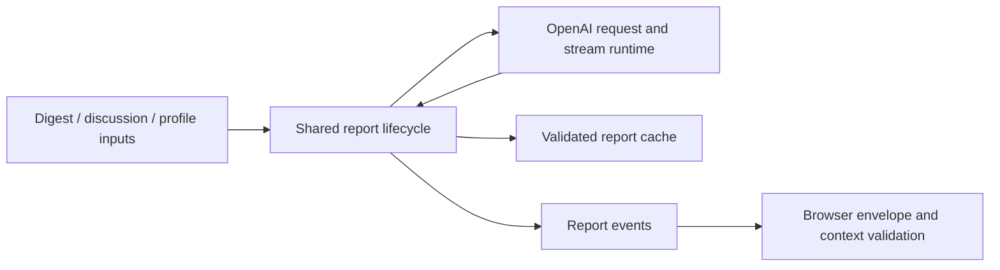

# Data And Architecture

Search persistence lives in `search-index.ts`. The derived `search_rows` table maps each canonical tweet or DM ID to an indexed integer FTS row ID. Its `INTEGER PRIMARY KEY` survives `VACUUM` and changes to canonical tables' implicit rowids. Inserts, updates, retention cleanup, and preview removal use indexed lookups instead of scanning the archive for unindexed string IDs. Small updates skip unchanged text; batches of at least 4,096 IDs replace the selected documents without probing each old FTS body. Processing retains at most 4,096 document rows at a time and finishes their reads before deleting and inserting index entries. JSON-bound bulk insertion preserves ascending FTS row order.

Live sync, replies, archive imports, and backup merges share this writer. Each caller finishes its canonical merge before refreshing the touched search entries within the same transaction. Primary tweet payloads, richer Note Tweet content, deletion state, and repeated DM IDs therefore determine the final indexed text. Failed indexing rolls back the canonical batch. Full backup replacement clears the derived mapping; portable backups continue to store canonical records only.

Schema 13 rebuilds search rows once from active canonical content, repairing legacy duplicate, orphan, deleted, and superseded entries. The FTS column names, query syntax, and snippets remain unchanged. Stop older writers before writable startup applies the migration; all subsequent writers must maintain the derived mapping. Read-only deployments require an upgraded snapshot.

Schema 14 adds a singleton `network_map_revision` table and SQLite triggers for map inputs. Changes to profile identity, names, follower counts, locations, current graph membership, or consumed geocode fields advance the index revision. Avatar, following-count, and verification updates advance a separate display revision. Identical map fields and unrelated tweet, DM, profile-history, and sync timestamp writes leave these revisions unchanged. Inserts and deletes conservatively advance the index revision, including SQLite REPLACE operations. The counters commit or roll back with canonical data and are not part of portable backups.

Read-only map validation and hydration remain inside the owning reader's transaction. Index changes rebuild the map; display changes clear only the bounded profile cache. Local writes through an explicitly supplied writable connection remain conservatively tracked through `total_changes()` to prevent reuse of uncommitted, rolled-back versions. Suppressed geocodes also impose an expiry boundary. Upgrade through writable initialization before serving a schema-14 snapshot read-only; WAL and durability settings are unchanged.

## Effect Runtime Boundary

Birdclaw's core I/O code should be written as Effect programs. Use `Effect.gen` for multi-step workflows, typed failures for expected errors, and `Effect.forEach` / `Effect.sleep` for concurrency, retry, timeout, and pacing logic.

Keep framework edges boring:

- CLI command handlers may `await` Promise wrappers.
- React components may call Promise wrappers from effects and event handlers.
- route handlers may return normal `Response` values.

The browser API adapter in `src/lib/api-client.ts` uses native Promises and
`AbortSignal`, with schema validation and `ApiFetchError` at the HTTP boundary.
React Query owns request cancellation, caching, and retries. Keeping this UI
adapter independent of Effect avoids downloading the server workflow runtime
for ordinary page reads; server and CLI core I/O retain their Effect programs.

Inside `src/lib`, prefer exporting both forms when useful:

```ts
export function runThingEffect(
	input: Input,
): Effect.Effect<Output, ThingError> {
	return Effect.gen(function* () {
		// core logic
	});
}

export function runThing(input: Input): Promise<Output> {
	return runEffectPromise(runThingEffect(input));
}
```

Use `runEffectPromise` from `src/lib/effect-runtime.ts` for Promise wrappers so typed failures are thrown directly instead of being hidden behind Effect fiber failures.

Current migrated surfaces:

- typed Effect-to-Promise boundary handling in `src/lib/effect-runtime.ts`
- `bird` command availability and execution in `src/lib/bird-command.ts`
- `bird` JSON transport, large stdout capture, and temp-file cleanup in `src/lib/bird.ts`
- `xurl` command execution, JSON parsing, retry delay, mutation helpers, and public adapter wrappers in `src/lib/xurl.ts`
- backup export/import/validation, Git repo setup, pull, commit/push, stale auto-update, and auto-sync orchestration in `src/lib/backup.ts`
- moderation action transport fallback and bird action/profile adapter helpers in `src/lib/actions-transport.ts` and `src/lib/bird-actions.ts`
- moderation target resolution, shared local moderation state, thin block/mute wrappers, and remote block sync in `src/lib/moderation-target.ts`, `src/lib/moderation-state.ts`, `src/lib/blocks.ts`, and `src/lib/mutes.ts`
- canonical profile database-row, prefixed-join, JSON-object, and handle codecs in `src/lib/profile-row.ts` and `src/lib/json-codec.ts`
- batch blocklist file import in `src/lib/blocklist.ts`
- authored, mentions, mention-thread sync including xurl recent-search and parent-walk fallback internals, conversation surface, home timeline, saved collection, DM live sync, profile hydration/resolution/affiliation, profile-reply inspection, shared tweet lookup, research and whois report generation, inbox scoring, and follow graph live sync cache/fetch/merge flows in `src/lib/authored-live.ts`, `src/lib/mentions-live.ts`, `src/lib/mention-threads-live.ts`, `src/lib/conversation-surface.ts`, `src/lib/timeline-live.ts`, `src/lib/timeline-collections-live.ts`, `src/lib/dms-live.ts`, `src/lib/profile-hydration.ts`, `src/lib/profile-affiliation-hydration.ts`, `src/lib/profile-resolver.ts`, `src/lib/profile-replies.ts`, `src/lib/tweet-lookup.ts`, `src/lib/research.ts`, `src/lib/whois.ts`, `src/lib/inbox.ts`, and `src/lib/follow-graph.ts`
- link preview metadata fetches and link-index backfill concurrency in `src/lib/link-preview-metadata.ts` and `src/lib/link-index.ts`
- `media fetch` archive reuse, HTTP download groups, pacing, and bounded concurrency in `src/lib/media-fetch.ts`
- archive discovery plus separated archive reader, slice parser, profile/DM reconciliation, media extraction, and transactional apply boundaries in `src/lib/archive-finder.ts`, `src/lib/archive-import.ts`, and `src/lib/archive/`
- avatar read-through caching and URL expansion cache/fetch flows in `src/lib/avatar-cache.ts` and `src/lib/url-expansion.ts`
- OpenAI inbox scoring fetch/parse boundary in `src/lib/openai.ts`
- scheduled bookmark sync audit logging, overlap locking, backup pass, and launchd install in `src/lib/bookmark-sync-job.ts`
- web sync orchestration, plan runners, backup pass, and job polling in `src/lib/web-sync.ts`

Core production `src/lib` code should stay free of ad hoc `async`/`await` orchestration. The browser API adapter is a framework boundary, including its paced HTTP sync-job polling. Next migrations should target remaining CLI, React, and route edges only where an Effect boundary would simplify error handling, cancellation, retries, or concurrency; otherwise keep those framework adapters small.

## Transport Strategy

Support these adapters:

- `xurl`
- `bird`

### Recommendation

v1 transport priority:

1. `archive`
2. `xurl`
3. `bird`

Reason:

- working `xurl` already exists
- users with `xurl` setup get zero-friction sync
- `bird` can cover GraphQL/cookie-backed gaps if needed

### `xurl` compatibility

Important stance:

- do not "pretend to be xurl" by mutating or owning `~/.xurl` format in v1
- shell out to `xurl` as an adapter instead

Why:

- lower auth risk
- lower coupling to xurl store internals
- birdclaw stays transport-agnostic
- users already authenticated in `xurl` get immediate value

Possible later feature:

- `birdclaw auth import-xurl`
- local one-shot import into birdclaw-managed credentials
- opt-in only

### `bird` compatibility

Treat `bird` the same way:

- adapter, not architecture
- subprocess or wrapper boundary
- no dependency on `bird` config/storage as core truth
- useful for GraphQL/cookie-backed reads or actions when `xurl` does not cover a surface

### Transport interface

```ts
import type { Effect } from "effect";

type TransportTask<A, E = TransportError> = Effect.Effect<A, E>;
type TransportKind = "archive" | "xurl" | "bird";

interface BirdTransport {
	kind: TransportKind;
	capabilities(): TransportTask<TransportCapabilities>;
	currentUser(): TransportTask<AccountIdentity>;
	listBookmarks(input: CursorInput): TransportTask<Page<BookmarkRecord>>;
	listLikes(input: CursorInput): TransportTask<Page<LikeRecord>>;
	listMentions(input: CursorInput): TransportTask<Page<TweetRecord>>;
	listFollowers(input: CursorInput): TransportTask<Page<ProfileRecord>>;
	listFollowing(input: CursorInput): TransportTask<Page<ProfileRecord>>;
	listOwnedLists(input: CursorInput): TransportTask<Page<ListRecord>>;
	listMembers(input: ListMembersInput): TransportTask<Page<ProfileRecord>>;
	listUserTweets(input: UserTimelineInput): TransportTask<Page<TweetRecord>>;
	listDmEvents(input: DmEventsInput): TransportTask<Page<DmEventRecord>>;
	getTweet(id: string): TransportTask<TweetRecord | null>;
	postTweet(input: ComposeTweetInput): TransportTask<PostResult>;
	reply(input: ReplyInput): TransportTask<PostResult>;
	blockProfile(input: ProfileActionInput): TransportTask<ActionResult>;
	unblockProfile(input: ProfileActionInput): TransportTask<ActionResult>;
	muteProfile(input: ProfileActionInput): TransportTask<ActionResult>;
	unmuteProfile(input: ProfileActionInput): TransportTask<ActionResult>;
}
```

### Transport config

Per account:

- preferred transport: `auto | xurl | bird`
- fallback chain
- capability cache
- auth status snapshot

`auto` means:

- use `xurl` if available and healthy
- else use `bird` if available and healthy
- else archive-only mode

## Data Model

Native SQLite only. Transactional, append-only migrations define the schema; focused row codecs map repeated query records.

### Core tables

- `accounts`
  - local account metadata
  - preferred transport
  - sync defaults
- `profiles`
  - Twitter users/authors/participants
  - keep bio, follower/following counts, profile URL, location, verification type, structured URL entities, raw profile JSON, and lightweight influence fields queryable in canonical columns
  - DM surfaces should render sender bio and influence context from here without needing raw payload lookups
- `profile_affiliations`
  - active subject-to-organization affiliation edges from X profile badges / highlighted labels
  - stores organization id or deterministic synthetic id, label, handle, badge URL, URL, source, and first/last-seen timestamps
  - synthetic highlighted-label ids are upgraded to real local organization profile ids when `bird` can hydrate the org handle
- `profile_snapshots`
  - deduplicated history of hydrated profile identity fields
  - stores bio, display name, handle, location, profile URL, verification type, counts, active affiliations, raw JSON, and first/last seen timestamps per state
  - lets `whois` explain current-vs-former affiliation or bio evidence instead of losing overwritten profile text
- `profile_bio_entities`
  - first-class extracted identity hints from profile bio/URL/affiliations
  - stores active and inactive `handle`, `domain`, and `company_phrase` values with first/last seen timestamps
  - feeds fuzzy identity ranking for prompts such as `blacksmith guy`, where `@useblacksmith` or `blacksmith.sh` is stronger than a generic DM keyword
- `blocks`
  - account-scoped local blocklist
  - canonical local state for blocklist UI and CLI
- `mutes`
  - account-scoped local mutelist
  - canonical local state for CLI moderation actions
  - live transport result layered on top, not required for local bookkeeping
- `tweets`
  - canonical tweet rows
  - text, metrics, timestamps, references, author id
  - explicit deletion timestamp, source, and reason; absence from a later snapshot never sets them
  - supersession timestamp and terminal revision ID keep older edit bodies lossless but inactive
- `tweet_revisions`
  - ordered revision identities from observable X edit history
  - retains raw revision payloads only when the body was actually observed
  - an explicit deletion on any revision tombstones every retained body in the chain
- `tweet_subordinate_tombstones`
  - media and quote-relation tombstones derived from explicitly deleted parent tweets
- `follow_edges`
  - current complete directional graph for `followers` and `following`
- `follow_snapshots`
  - snapshot metadata for follower/following crawls, including complete/incomplete status
- `follow_snapshot_members`
  - normalized membership per snapshot
- `follow_events`
  - append-only started/ended follow events
- `bookmarks`
  - account-scoped saved tweet ids
- `likes`
  - account-scoped liked tweet ids
- `threads`
  - optional thread/cache grouping
- `dm_conversations`
- `dm_events`
  - event log, not only message text
- `dm_participants`
- `dm_payloads`
  - full text / URLs / reactions / attachments when retained
- `sync_cursors`
  - one row per stream + transport + account + scope
- `import_runs`
- `sync_runs`
- `raw_objects`
  - optional retained source payloads for reparsing

### Search tables

- `tweets_fts`
- `dm_fts`

Use FTS5.

Day-1 search modes:

- exact filters
- keyword full-text
- date ranges
- author / conversation / bookmarked / liked filters
- DM sender follower-count filters
- DM sender derived influence-score filters
- replied / unreplied filters for mentions and DMs
- local block/mute maintenance via handle, id, or URL-derived profile match

No vector search required for MVP.

### Indexing

Schema 12 extends the chronological tweet index to `(created_at desc, id desc)` so bounded candidate selection can read timestamp ties directly in page order. A partial covering index on `follow_edges(account_id, profile_id, direction) where current = 1` supplies map membership without a table lookup or grouping sort. The existing direction/last-seen index remains available for graph history queries. Writable startup applies the migration transactionally; read-only deployments require an upgraded snapshot. WAL, foreign-key enforcement, and durability settings are unchanged.

Indexes from day 1:

- tweet id unique
- author + created_at desc
- created_at desc
- conversation + occurred_at desc
- bookmark/account + created_at desc
- like/account + created_at desc
- active follow edges by observer + direction
- follow events by observer + event_at desc
- latest follow snapshot by observer + type
- sync cursor unique by stream/account/scope/transport

## Follow Graph Model

Borrow the shape from `sweetistics`, but local-first and SQLite-native.

Principles:

- directional edges, not dual booleans
- snapshots are the source of truth for full crawls
- events are append-only
- current state and history both matter

### Direction semantics

- Conceptual `inbound`: they follow the account
- Conceptual `outbound`: the account follows them
- Stored/API `followers`: inbound direction, matching the X endpoint and CLI command
- Stored/API `following`: outbound direction, matching the X endpoint and CLI command

### Tables

- `follow_edges`
  - primary key: `(account_id, direction, profile_id)`
  - `account_id` is the observer account; `profile_id` is the subject profile
  - fields: `current`, `first_seen_at`, `last_seen_at`, `ended_at`, `source`, `updated_at`
- `follow_snapshots`
  - one row per full followers/following crawl
  - fields: `direction`, `status`, `page_count`, `result_count`, `source`, `raw_meta_json`
- `follow_snapshot_members`
  - normalized set of members per snapshot
- `follow_events`
  - append-only `started` / `ended`
  - references snapshot/run when available
  - idempotent per account
- `x_lists`
  - durable owned-List metadata, source, freshness, bounded-sync parameters, and `complete | inferred | partial | error` membership state
- `x_list_members`
  - primary key: `(account_id, list_id, profile_id)`
  - current/ended membership edges; only cursor-proven complete syncs end unseen members

### Cache and cost guardrails

- `sync followers` and `sync following` default to dry-run and do not call X
- live xurl sync requires `--yes`
- fresh sync results are stored in `sync_cache` and reused by matching sync commands unless `--refresh` is passed
- graph query commands only read `follow_edges`, `follow_snapshots`, `follow_snapshot_members`, `follow_events`, and `profiles`
- incomplete snapshots keep fetched members for audit but do not update current edges or churn events

### What this buys us

- current followers/following lists
- mutuals
- churn over time
- "who came in"
- "who left"
- first seen / last seen
- account growth graph
- graph-aware AI ranking later

### UI ideas

- follows dashboard
- arrivals / departures timeline
- mutuals view
- notable churn
- relationship detail for one profile
- graph overlays in the AI inbox

## Archive Import

### Inputs

- Twitter export zip
- extracted archive directory

### Supported archive slices in v1

- account
- tweets
- likes
- bookmarks if present
- profiles
- direct messages
- followers
- following
- owned Lists and List membership

### Import pipeline

1. inspect manifest / discover files
2. parse wrapper JS payloads
3. normalize records
4. write canonical entities
5. update import provenance
6. refresh FTS

### Rules

- idempotent reruns
- preserve richer existing data
- merge destination-only rows by default; a record missing from a later archive is not a deletion
- only explicit deleted-tweet records create source-attributed tombstones
- hide tombstoned tweets and their subordinate media/quote relations from active indexes while retaining lossless archive state
- retain observable edit-history identities and payloads without inventing unobserved revision bodies; superseded revisions are not active content
- full import merges all supported archive slices together
- selected import merges only requested slices and preserves unselected local data
- explicit `--restore` replaces imported slices exactly
- merge imports and selected restores validate `acct_primary` identity before writing; only a full restore may replace it
- selected collection imports preserve live collection rows and local tweet ownership
- selected DM imports are scoped to `acct_primary` and preserve other accounts

Selected import slices:

- `tweets`
- `likes`
- `bookmarks`
- `profiles`
- `directMessages`
- `followers`
- `following`

## Sync Model

Streams:

- own tweets
- mentions
- likes
- bookmarks
- DMs
- followers
- following

Future:

- notifications
- graph analytics

### Sync behavior

- cursor-based where possible
- account-scoped checkpoints
- dedupe on canonical IDs
- partial success preserved
- safe rerun after crash

## Local Web App

### Purpose

Primary human UI.

### Views

- inbox
  - AI-ranked blend of mentions, replies, DMs, bookmarks to revisit, notable posts
- timeline/search
- tweet detail
- thread detail
- DM conversation
- DM conversation
  - persistent sender context with bio and follower count
  - filter by sender influence band
  - filter replied vs unreplied
- bookmarks
- likes
- follows dashboard
- mutuals
- follow event history
- sync status
- account/auth/transports
- compose/reply

### AI layer

Local-first ranking metadata stored in DB:

- score
- reason codes
- summary
- labels
- dismissed state
- acted-on state

Candidate ranking inputs:

- author importance
- sender follower count / influence
- sender bio cues
- reply intent
- mention density
- follower relationship
- conversation recency
- prior engagement
- bookmark/like overlap
- DM priority
- follow-graph proximity
- churn salience

### Web server mode

`birdclaw serve`

- starts the built local production server
- serves SSR routes and compiled static assets
- exposes sync health and recent job state in the UI

## Profiles / Accounts

Support profiles from day 1.

Reason:

- separate DBs or configs for personal/test/future shared use
- easier OSS story

Default:

- one profile named `default`

## Auth / Secrets

Do not store secrets in config JSON.

Options by transport:

- `xurl`
  - birdclaw shells out to `xurl`
  - auth remains managed by `xurl`
- `bird`
  - birdclaw shells out to `bird` or wraps a narrow stable surface
  - useful for GraphQL/cookie-backed capabilities

## Package Layout

Birdclaw is one package with shared core modules, not a multi-package workspace:

```text
birdclaw/
  bin/birdclaw.mjs       # installed CLI launcher
  src/
    cli.ts              # CLI entry and command context
    cli/                # command registration by domain
    components/         # React views and controllers
    routes/             # TanStack pages and HTTP API handlers
    lib/                # storage, query models, transports, sync, and analysis
      archive/          # archive readers, slices, reconciliation, and apply
    test/               # shared fixtures and test helpers
  scripts/              # builds, toolchain verification, package and perf proof
  playwright/           # production-server browser tests
  docs/                 # user guides and architecture
```

SQLite connection ownership lives in `src/lib/db.ts`; ordered schema definitions live in `src/lib/database-schema.ts`, and `src/lib/database-migrations.ts` applies them transactionally. `src/lib/backup-filesystem.ts` owns backup path safety and durable filesystem operations; `src/lib/backup.ts` coordinates export, import, recovery, and Git synchronization.

Automatic backup updates and synchronization share configuration and state bookkeeping. Only the update path skips fresh checks; synchronization still exports local changes during that freshness window. Their repository operations, locking, and recovery policies remain separate. Profile URL entities use one parser in `profile-row.ts` for identity indexing, bio extraction, and `whois`, retaining each caller's choice of profile-URL or description entities.

Portable backup tables declare their columns and merge policies once in `backup-table-codecs.ts`; export projections, insert bindings, and conflict assignments are derived from that declaration. Complex retention and revision rules stay explicit SQL expressions. API-facing domain types are inferred from the existing Zod output schemas in `api-contracts.ts`, with type-only imports keeping validation and server workflows out of consumers that need only types.

`analysis-report.ts` owns the report lifecycle: model request construction, stream or complete-response delivery, cache serialization and validation, and completion events. Individual analyses supply their context, prompts, result schemas, and versioned cache identity. Digest input refresh, cited-tweet enrichment, and the latest-report cache remain digest policies; profile analysis retains its completed-response delivery. The report layer persists successful results before publishing completion, and failed requests never create cached reports. Browser event schemas share the report envelope while validating each context and its supported event variants separately.



CLI input parsers throw to the existing command error boundary instead of printing an error and returning a failure sentinel.

Transport adapters shell out to `bird` and `xurl`; they do not own those tools' credentials or configuration. CLI and HTTP handlers share the canonical repositories and query models in `src/lib/`. The browser API boundary remains independent of the server's Effect workflows.

## Testing Plan

### Unit

- archive file parsing
- domain normalization
- SQL repositories
- FTS queries
- ranker behavior

### Integration

- import fixture archive into temp DB
- sync fixture pages into temp DB
- run search queries against populated DB
- verify `xurl` adapter against stubbed subprocess output
- verify follow graph snapshot -> diff -> events behavior

### Live

Opt-in only:

- real `xurl` health check
- real `bird` health check
- real sync smoke tests

## Distribution

Primary:

- npm package

Secondary later:

- standalone desktop wrapper if the web UX becomes primary

## Read-only status bootstrap

Single-account read-only deployments may include the status envelope in the
initial HTML after the same authorization checks as `/api/status`. The browser
seeds its status query from that envelope, so it can request account-scoped data
without another status round trip. Multiple-account and writable deployments
retain the existing client flow; server rendering cannot infer browser-local
account selection. Bootstrap failures fall back to the normal client request.
No archive discovery, live reads, or backup updates run in the bootstrap.
Server query clients remain request-local and do not retain timed GC entries.

### Read-only query response reuse

After authorization and filter parsing, `/api/query` may reuse validated serialized JSON in read-only deployments. Entries are scoped to the reader connection and normalized resource/filter arguments, including account selection. Each lookup checks SQLite `data_version`; changed databases drop their prior entries. A second check avoids retaining a response across an external commit. The cache retains at most 100 entries and 4 MiB of encoded keys/values per reader, skips responses over 512 KiB and keys over 4 KiB, and evicts least-recently-used entries.

Writable deployments bypass this cache. Exceptions are not retained, and response bodies remain independent. This is process-local reuse of deterministic reads, not an HTTP cache: authentication and HTTP cache policy remain unchanged.

Links also has a bounded cache per read-only reader. Indexed probes find the last occurrence before each time bound. Results may be reused while those positions and the database version remain unchanged, even as a rolling window's displayed timestamps advance. The probes and result run within one read transaction on the cache's owning connection. Boundary crossings, external commits, account/filter changes, and pool replacement cause recomputation; returned objects are independent. Each reader retains at most 100 entries / 4 MiB, with the existing 512 KiB entry limit.

Ordinary timeline reads materialize their limited membership before hydrating reply/quote profiles and collection metadata. Ordinary timeline selection retains account/author joins before the limit so malformed orphan rows cannot shorten a page. Saved-post reads keep their collection query plan. Search retains its existing bounded selection and join order, and recent-window fallback, account preference, filters, and keyset ordering remain unchanged.

Recent-window candidate order includes tweet IDs so timestamp ties match the final page order. Account-scoped and literal-account callers retain their existing membership rules.

## DM read views

`GET /api/query?resource=dms` retains the combined list and selected-thread
response used by existing clients. The web workspace bootstraps with the combined response, then requests `view=list` for
conversation metadata and `view=conversation&conversationId=...&account=...`
for a selected thread. The latter returns an empty `items` array and the
account-scoped `selectedConversation`, or null when it is unavailable. List
filters apply to the list; the thread view selects by conversation ID and account.

The initial combined response seeds the thread cache without a second request.
The browser caches thread responses by account and conversation separately from
list filters. Sync and successful writes invalidate both caches. The browser requests the newest 100 messages (`messageLimit=100`) and loads older
pages on demand through the returned `selectedConversation.nextCursor`. A cursor
is passed as `before` with `view=conversation`, its exact `conversationId`, and
`messageLimit`; malformed or cross-conversation cursors are rejected. Message
pages are capped at 200 and use creation time plus message ID to handle ties.
Calls without `messageLimit`, including existing combined/API and CLI full-thread
reads, retain complete history. All messages remain accessible through pagination.
